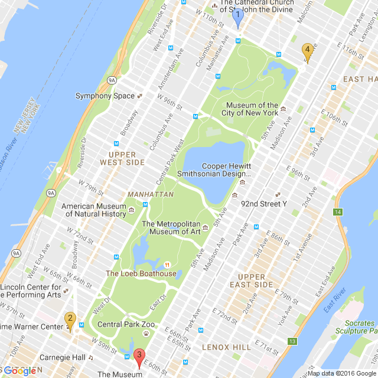
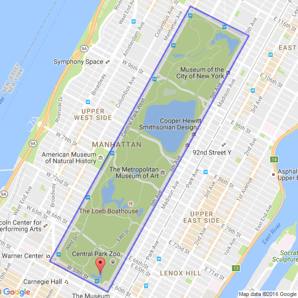
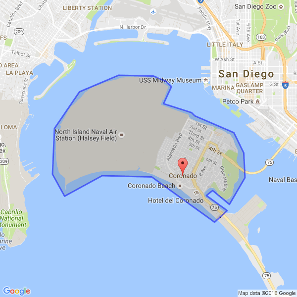

## Overview 
* [Introduction](#introduction)
* [Instructions](#instructions)
* [Example: 4 point geofence - Central Park, New York, NY](#example-4-point-geofence---central-park-new-york-ny)
* [Example: 21 point geofence - Coronado, San Diego, CA](#example-21-point-geofence---corando-island-san-diego-ca)
* [Example: Multiple Geofences in the same `geofences.txt` file](#example--multiple-geofences-in-the-same-geofencestxt-file)
* [Geofence Generator: Draw Your Own Geofence](#geofence-generator-draw-your-own-geofence)


## Introduction
Geofencing will restrict PokeAlarm alerts to a defined geographical area.  The area is defined by a list of at least 2 sets of latitude and longitude coordinates.  You may provide as many coordinates as you'd like to define your area of interest, provided that these sets are in the order that defines your polygon.

**Note:** PokeAlarm will first check pokemon alert distance, *then* will check to see if the pokemon is located within your geofence.  See [Pokemon configuration](https://github.com/kvangent/PokeAlarm/wiki/Pokemon-Configuration) on how to limit alerts based on distance.

## Instructions

Create a text file with with a series of at least 2 *latitude,longitude* sets and place this in the same folder as `start_pokealarm.py`.

**To define a rectangular geofence:**  Use 2 lat/lon sets, with the first set defining the top left of the rectangle, and the second defining the bottom right of the rectangle.

**To define a polygonal geofence:** Provide as many lat/lon sets as it takes to define your polygon.  Make sure that you provide the points **in order** to describe the polygon.

Execute `start_pokealarm.py` with the `-gf` or `--geofencing` flag, along with the path to your geofence file, or add `geofence:YOUR_GEOFENCE_FILE` to `config.ini`.

## Example: 4 point geofence - Central Park, New York, NY

The text file below defines the northwest, southwest, southeast and northeast corners of central park. The heading in brackets `[NAME_OF_GEOFENCE]` is mandatory, and PokeAlarm will fail if not included in the geofence file.

file central-park-geofence.txt
```
[Central Park, NY]
40.801206,-73.958520
40.767827,-73.982835
40.763798,-73.972808
40.797343,-73.948385
```



In the image above, each numbered marker 1-4 represents the lat,lon coordinates found in central-park-geofence.txt, respectively.

To run PokeAlarm with geofencing enabled, execute:

`python runwebhook -gf central-park-geofence.txt`

or

`python runwebhook --geofence central-park-geofence.txt`

or you can include `geofence:central-park-geofence.txt` in your `config.ini` file.

If successful, you should receive a confirmation in your log:

```
2016-08-20 10:32:09,571 [          geofence] [   INFO] Creating geofence...
2016-08-20 10:32:09,710 [          geofence] [   INFO] Geofence established!
```

For our Central Park example, all 4 points encompass the entire park.  The visual of the geofenced area is below.  The red marker in the image denotes a selected location, here, "The Pond, Central Park, NY".



PokeAlarm will then notify you of pokemon within the shaded area.

## Example: 21 point geofence - Corando Island, San Diego, CA

You may add as many lat,lon points to define you polygon, provided that the points in your geofence file are in order of defining said polygon.  Below is an example of a 21 point polygon encompasing an area.


file:  `geofence_coronado.txt`
```
[Coronado, CA]
32.7134997863394,-117.18893051147461
32.71508853568461,-117.19330787658691
32.715305181130056,-117.20541000366211
32.71046664083005,-117.2189712524414
32.69977759183938,-117.22764015197754
32.6864144801245,-117.22832679748535
32.679985027301136,-117.22412109375
32.6859810484179,-117.21107482910156
32.685619853722,-117.19390869140625
32.67239912263756,-117.1721076965332
32.675794797699766,-117.1677303314209
32.68020175796835,-117.17494010925293
32.68164661564297,-117.17279434204102
32.677600955252075,-117.16695785522461
32.68540313620318,-117.16155052185059
32.692626770053714,-117.16197967529297
32.698549713686894,-117.16541290283203
32.70346112493775,-117.17897415161133
32.704400040429604,-117.18008995056152
32.70700006253934,-117.18978881835938
32.711983226476136,-117.18704223632812
```

Below is the resulting geofence:



## Example:  Multiple Geofences in the same `geofences.txt` file
You are permitted to add more than one geofence area in a single `geofences.txt` file. Add a bracketed header before each set of coordinates. For example:

```
[Central Park, NY]
40.801206,-73.958520
40.767827,-73.982835
40.763798,-73.972808
40.797343,-73.948385

[Coronado, CA]
32.7134997863394,-117.18893051147461
32.71508853568461,-117.19330787658691
32.715305181130056,-117.20541000366211
32.71046664083005,-117.2189712524414
32.69977759183938,-117.22764015197754
32.6864144801245,-117.22832679748535
32.679985027301136,-117.22412109375
32.6859810484179,-117.21107482910156
32.685619853722,-117.19390869140625
32.67239912263756,-117.1721076965332
32.675794797699766,-117.1677303314209
32.68020175796835,-117.17494010925293
32.68164661564297,-117.17279434204102
32.677600955252075,-117.16695785522461
32.68540313620318,-117.16155052185059
32.692626770053714,-117.16197967529297
32.698549713686894,-117.16541290283203
32.70346112493775,-117.17897415161133
32.704400040429604,-117.18008995056152
32.70700006253934,-117.18978881835938
32.711983226476136,-117.18704223632812
```

## Geofence Generator: Draw Your Own Geofence
Our @brettgus has developed [Geofence Generator](http://codepen.io/bgus/full/dXxLjp/), a handy web tool to easily create and visualize your desired geofence.  To use it:

1. Type your desired location.
2. Click for each geofence point that you would like to add to the coordinate list.
3. Complete your geofence area by clicking the original point.
