## Overview
* [Prerequisities](#prerequisities)
* [Introduction](#introduction)
* [Enabling the Various Google Maps APIs and Obtaining a Key](#enabling-the-various-google-maps-apis-and-obtaining-a-key)
* [Testing Your API Key](#testing-your-api-key)
  * [Geocoding](#geocoding)
  * [Distance Matrix](#distance-matrix)
  * [Static Maps](#static-maps)
* [Starting PokeAlarm with a Google Maps API Key](#starting-pokealarm-with-a-google-maps-api-key)
* [Google API Daily Limit](#google-api-daily-limit)

## Prerequisities
  
This guide assumes:

1. You have a functional PokeAlarm installation
2. You have an available Google account (e.g., Gmail)
3. You have read and understood the available Command Line Arguments in the [Execution](Execution) Wiki

## Introduction

Using a Google Maps API key in PokeAlarm is **optional**.  It enable additional features in PokeAlarm.

In order to use a feature, you must have the corresponding API enabled in Google API Manager, and have a generated Google Maps API key.  Below are the available features, and Google Map API to enable for that feature:


| PokeAlarm Feature 					  						| Google Maps API to Enable					|
|:--------------------------------------------------------------|:------------------------------------------|
| Set a location by name or address								| Google Maps Geocoding						|
| Calculate walking/biking/driving distance from a set location	| Google Maps Distance Matrix				|
| Show a Mini Map of pokemon, gyms, or lures in Slack			| Google Static Maps						|

You will enable the APIs per the requirements of you own PokeAlarm installation.  In other words, if you only want static maps, enable just the Google Static Maps API.  If you want static maps and to set your location, enable the Google Static Maps and Google Maps Geocoding APIs.

In this guide, we will:

1. Enable all 3 APIs and generate an API key that will allow PokeAlarm to provide these features
2. Test the key to make sure it working correctly
3. Start **PokeAlarm** with your API key

## Enabling the Various Google Maps APIs and Obtaining a Key
Now we're going create a new project, add our 3 APIs to it, then generate our API key.

1. Log into [Google API Manager](https://console.developers.google.com/).

2. Click **Dashboard** at the left.  If this is your first time visiting the developers console, you should see "No APIs enabled" in the middle, like the image below.
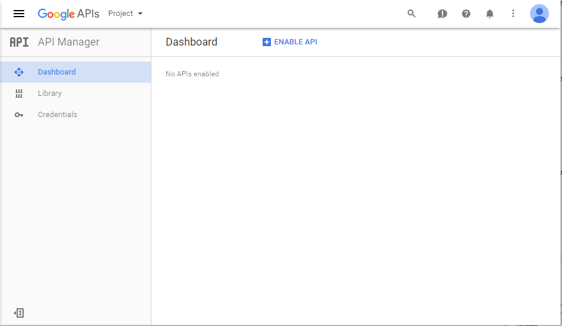  

3. At the top of the page, click the **Project** dropdown, then select **Create project**.
  

4. Name this project whatever you would like, e.g., "PokeAlarm".  Click **Create**.  
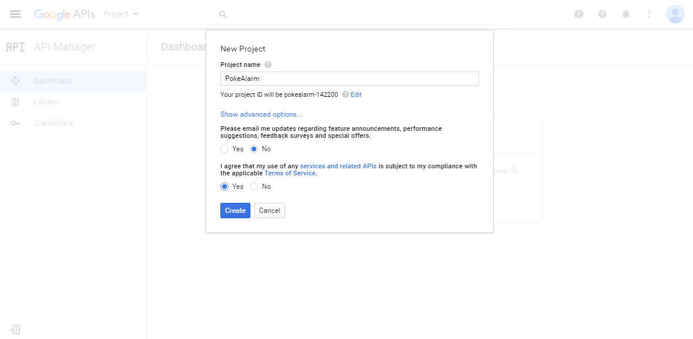

5. You should now see your project name at the top. Click the blue **+ENABLE API** button at the top middle, which will bring your to the Google API Library.  (You can also click **Library** at the left.)
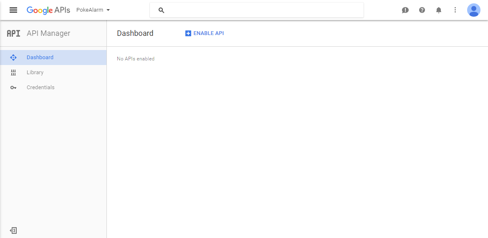

6. The Google API Library is where we will select our 3 APIs to enable.  Let's enable the **Google Maps Geocoding** API first.  You can either type **Google Maps Geocoding API** in the middle search bar, or click on it under the "Google Maps API" section in the middle right.
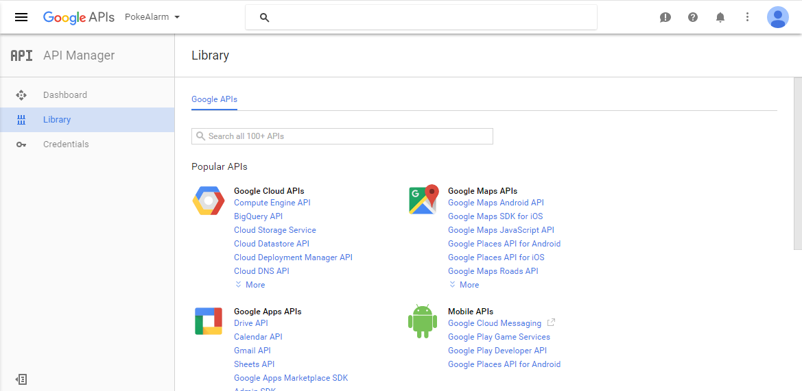

7. You should see **Google Maps Geocoding API**. Click the blue **ENABLE** button at the top to enable the Google Maps Geocoding API.
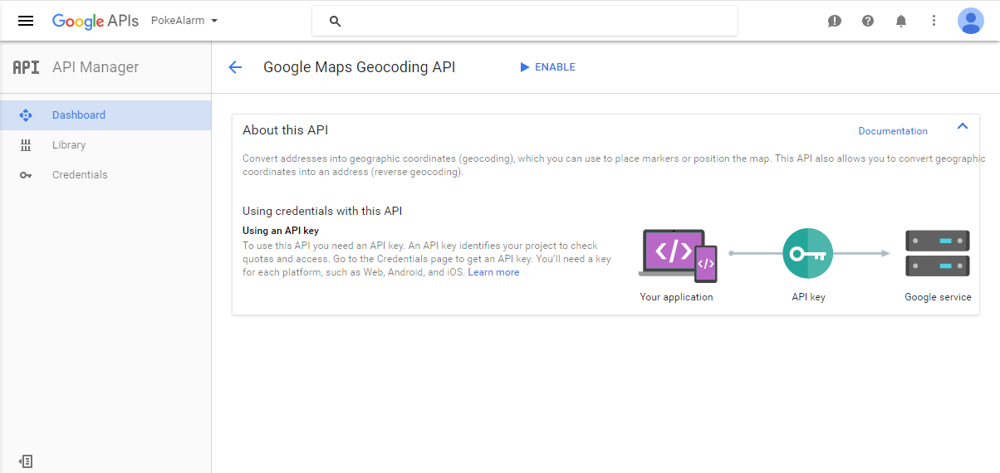
You should see this screen if enabled:
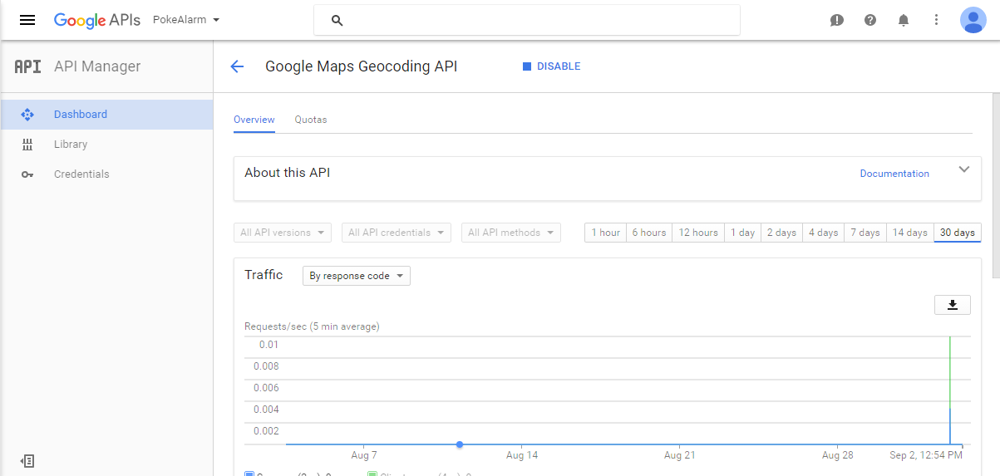
Click on **Dashboard** at the left.  You should now see **Google Maps Geocoding API** at the middle bottom.
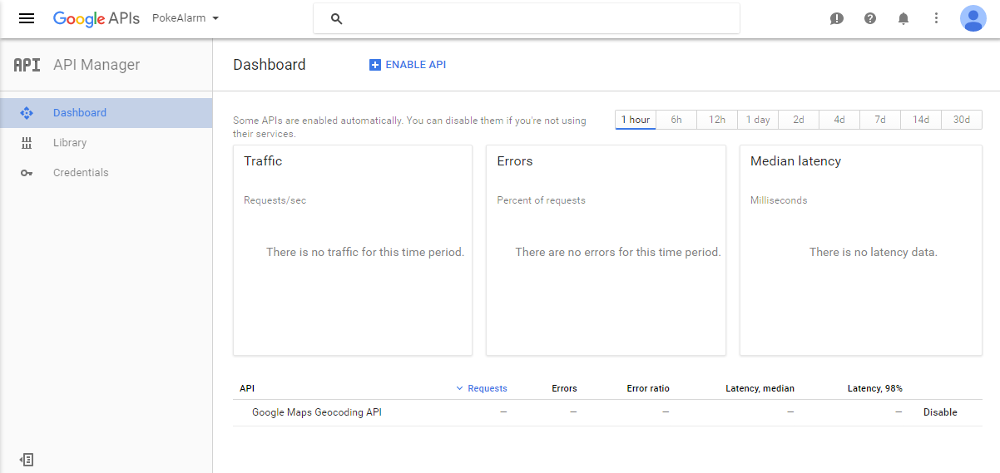

8.  Click on **Library** at the left and repeat the same process of enabling APIs for the **Google Maps Distance Matrix** and **Google Static Maps** APIs.  When you are finished, click **Dashboard** on the left and make sure that you see all 3 APIs at the middle bottom.
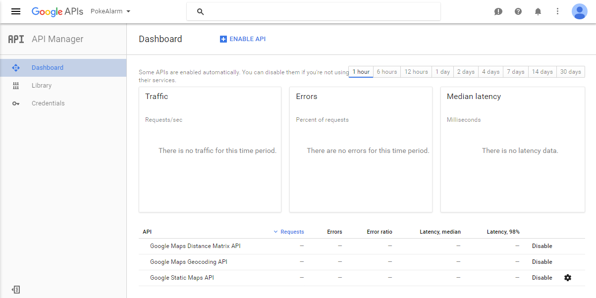

9. Now that we have the 3 APIs enabled, let's generate our API key.  Click on **Credentials** at the left, then the blue **Create Credentials** in the middle.
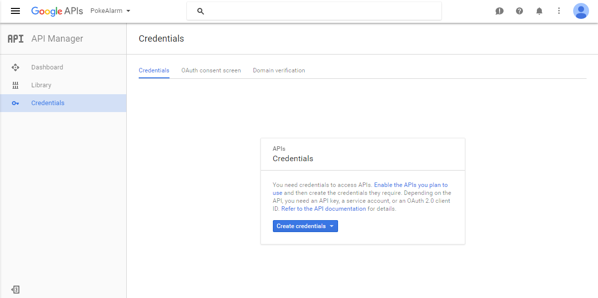

10. Click **API key** in the middle.
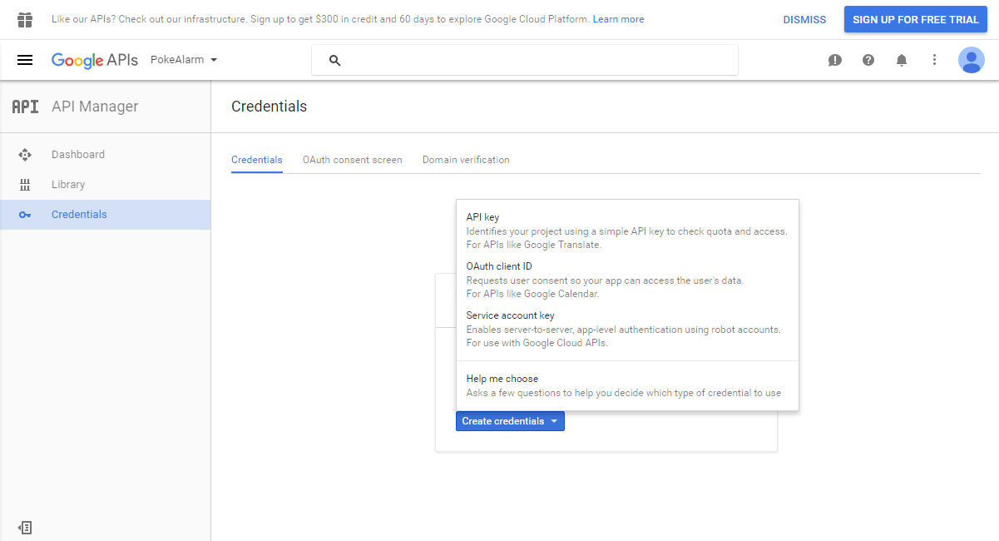

11. Select **Browser key**.
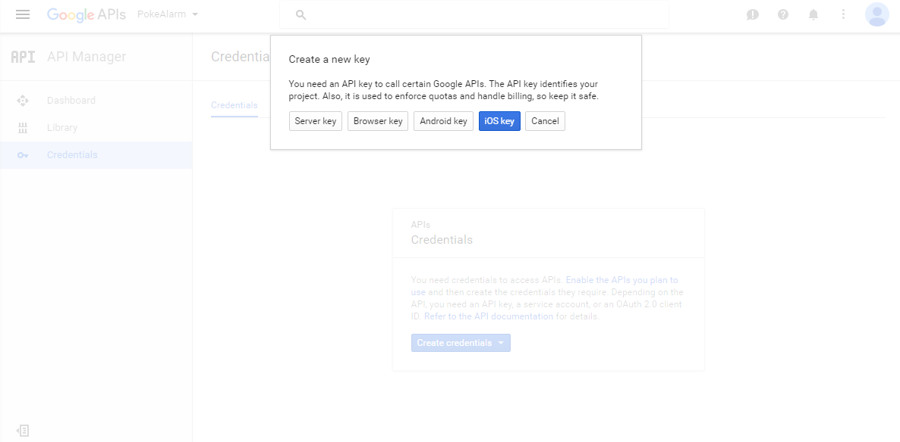

12. If desired, name your key, or leave it as the default name.  Click the blue **Create** button.
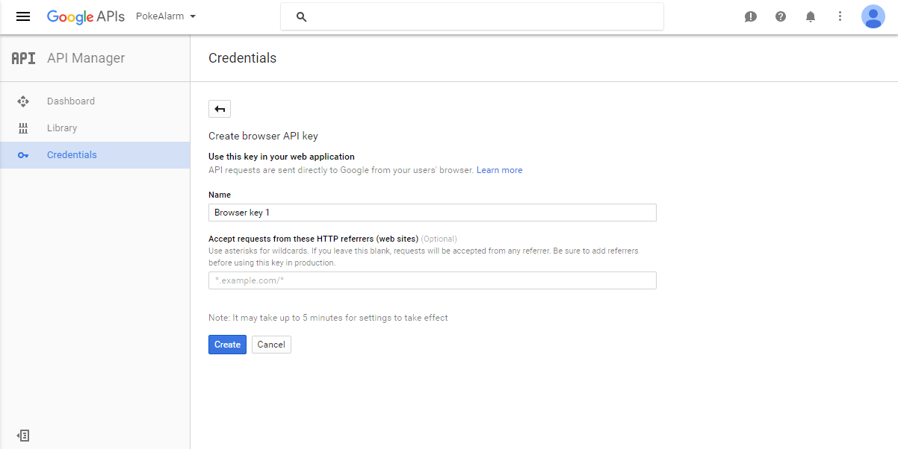

13. Your new API key will appear.  Click the blue **OK** button.
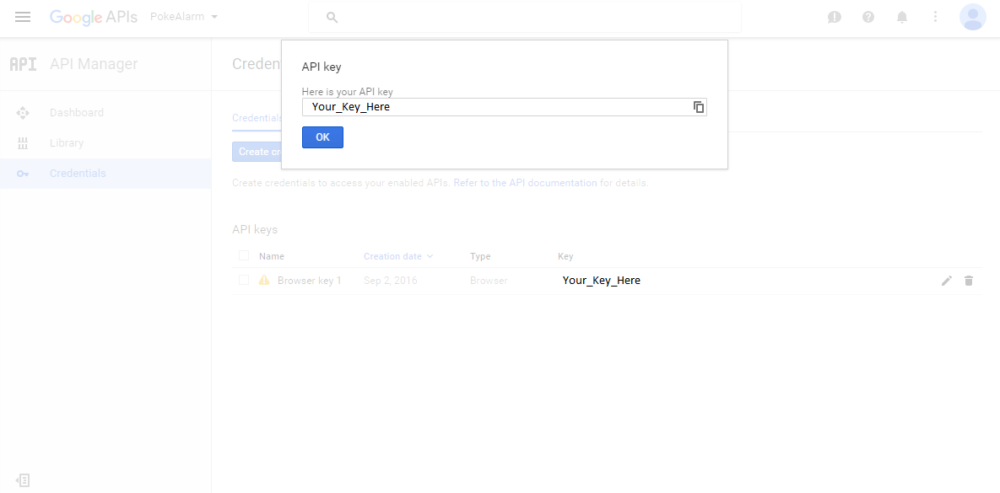
To find your key later, click on the blue **Credentials** button at the left.
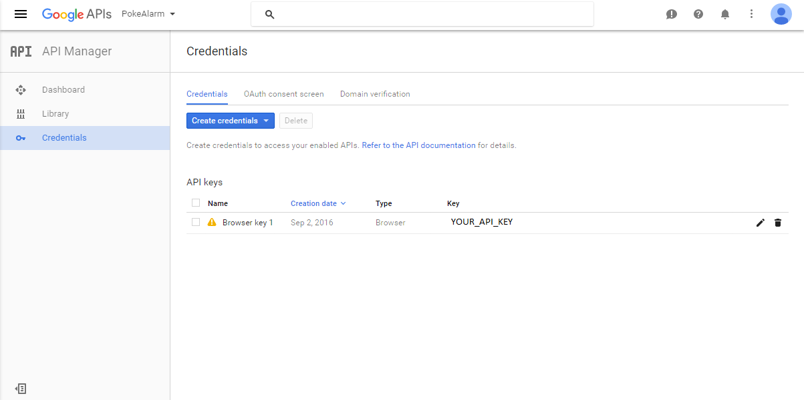


## Testing Your API Key

Now that you have your various APIs enabled and your API key created, let's test to see if it is working correctly.

### Geocoding
To verify that your API key is working for geocoding and reverse geocoding, visit the URLs below and replace `YOUR_API_KEY` with your Google Maps API key.

**Geocoding**
```
https://maps.googleapis.com/maps/api/geocode/json?address=1600+Amphitheatre+Parkway,+Mountain+View,+CA&key=YOUR_API_KEY
```
**Reverse Geocoding**
```
https://maps.googleapis.com/maps/api/geocode/json?latlng=40.714224,-73.961452&key=YOUR_API_KEY
```
### Distance Matrix
To verify that your API key is working for travel distance and time, visit the URLs below and replace `YOUR_API_KEY` with your Google Maps API key.

```
https://maps.googleapis.com/maps/api/distancematrix/json?units=imperial&origins=Washington,DC&destinations=New+York+City,NY&key=YOUR_API_KEY
```

### Static Maps
To verify that your API key is working for Static Maps, visit the URL below and replace `YOUR_API_KEY` with your Google Maps API key.
```
https://maps.googleapis.com/maps/api/staticmap?center=Brooklyn+Bridge,New+York,NY&zoom=13&size=600x300&maptype=roadmap&markers=color:blue%7Clabel:S%7C40.702147,-74.015794&markers=color:green%7Clabel:G%7C40.711614,-74.012318&markers=color:red%7Clabel:C%7C40.718217,-73.998284&key=YOUR_API_KEY
```
If your key is valid, you should see this same static map image in your browser:


## Starting PokeAlarm with a Google Maps API Key

There are 2 methods to start **PokeAlarm** with your Google Maps API key:

1. Run the command `python start_pokealarm.py -k YOUR_GOOGLE_MAPS_API_KEY`

2. Add `key:YOUR_GOOGLE_MAPS_API_KEY` to `config.ini` located in the `config` subfolder of your PokeAlarm installation, then run the command `python start_pokealarm.py`.


## Google API Daily Limit

Google allows up to 2,500 API requests per day for free.  You may view your API usage from the Dashboard of the [Google API Manager](https://console.developers.google.com/).  If you have exceeded the free daily quota of 2,500 hits, the mapping elements in PokeAlarm may not function correctly.  If you find that you are exceeding the free daily 2,500 API calls, you may either switch to another valid Google Maps API key for the day or sign up for a Google Maps API Premium plan.  For pricing information, visit the [Google Maps API Pricing and Plans page](https://developers.google.com/maps/pricing-and-plans/#details).
